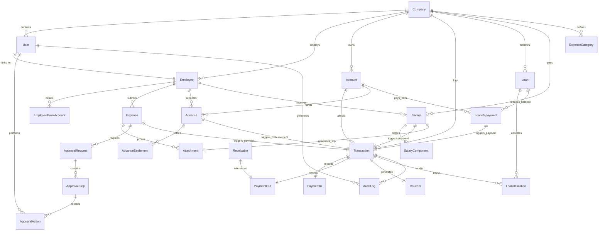

# Project Plan — Company Finance, Expense & Employee Management Portal

This document defines the comprehensive development and implementation plan for the Company Finance, Expense & Employee Management Portal. It is compiled by analyzing the Product Requirement Document (PRD), Backend Architecture, and Business Logic (Brain).

---

## 1. Major Modules

The system is divided into 20 core logical modules grouped by functionality:

### 1.1 Foundation & Administration
*   **Authentication & Session Management**: Email/username login, password hashing, session lifecycle, JWT Access Token (short-lived) + Refresh Token (long-lived, revocable) strategy.
*   **Role-Based Access Control (RBAC)**: Fine-grained, permission-based access control rather than simple role checks.
*   **Company Settings & Scope Control**: System configuration (metadata, financial year, company timezone, local currency) and strict scoping of every query/operation by `company_id`.
*   **Master Data Management**: CRUD operations for master categories (expense categories, payment modes, departments, designations, clients, vendors, loan sources).

### 1.2 Financial Core
*   **Financial Accounts Management**: Management of cash boxes, bank accounts, UPI channels, and company cards (opening balance, masked details, current balance).
*   **Central Transaction Ledger (TransactionService)**: The absolute system source of truth for all confirmed money movements. Updates balances using database transactions.
*   **Payment In**: Recording client payments, refunds, loans, interest, and advances with source categorization, reference numbers, and transaction proof.
*   **Payment Out**: Recording office expenses, vendor payments, staff advances, loan repayments, asset purchases, and client refunds. Handles balances and returnable tags.
*   **Account Transfers**: Internal transfers between accounts (e.g., Bank to Cash) with zero net change in total company assets.
*   **Voucher Management**: Centralized voucher generator producing unique, sequential voucher codes (e.g., `EXP-2026-000001`) and printable PDF vouchers.

### 1.3 Operations & Employee Tracking
*   **Office Expense Management**: Logging office overheads, utilities, software subscriptions directly into payments.
*   **Staff Expense Management**: Employee self-service for submitting business expenses, uploading receipt proofs, and tracking reimbursement status.
*   **Staff Advance Management**: Disbursing advances, tracking utilized expenses against advances, calculating returns or additional reimbursements, and closing advance cycles.
*   **Receivable / Returnable Money**: Tracking outgoing transactions marked as "Returnable" with expected return dates, actual returns, outstanding balances, and overdue calculations.
*   **Loan Management**: Tracking borrowed capital, linking loan utilization transactions to check remaining unallocated balances, and recording repayments split by principal and interest.

### 1.4 HR & Salary
*   **Employee Management**: Employee profiles, contact details, status lifecycles, designations, departments, and linked system user profiles.
*   **Employee Bank Verification**: Workflow for employees to submit bank details, verification by Accounts, and final approval by Admin.
*   **Salary Processing & Generation**: Monthly salary runs based on base structures, custom additions, and advance recoveries/deductions.
*   **Salary Payment Tracking**: Disbursing approved salaries, recording UTR/payment references, generating printable PDF salary slips, and updating the employee portal.

### 1.5 System Intelligence & Infrastructure
*   **Generic Approval Engine (ApprovalService)**: Centralized workflow manager handling approvals for expenses, advances, salaries, loans, and bank account changes. Supports configurable amount-based thresholds.
*   **Document & Attachment System**: Secure private S3-compatible document storage, validation (size, MIME type), and authorized retrieval via signed temporary URLs.
*   **Event-Driven Notifications**: In-app notifications and email dispatch alerts for lifecycle changes (approved, rejected, overdue, paid).
*   **Dashboards & Analytical Reports**: Aggregated view of cash flow, category expenses, loan outstanding, advances, and overdue receivables. Exports to Excel/CSV.
*   **Audit Trail System**: Read-only, append-only records of all critical actions containing old and new data states for security auditing.

---

## 2. Database Entities and Relationships



### 2.1 Entity Key Details
*   **Decimal Fields**: All monetary fields (balances, transaction amounts, salary components, principal, interest) must use `Decimal(18,2)` database numeric type to prevent floating-point anomalies.
*   **Unique Constraints**:
    *   `Voucher.voucher_no` is globally unique.
    *   `Employee.employee_code` is unique within a single `company_id`.
    *   `User.email` is globally unique.
    *   `Transaction.transaction_no` is globally unique.
*   **Soft Deletes**: Master data (employees, accounts, categories) implements soft delete using `deleted_at` and `deleted_by`. Ledger transactions cannot be deleted; they are reversed.

---

## 3. User Roles and Permissions Matrix

The system implements granular permissions mapped to four standard roles:

| Module / Scope | Permission Key | Super Admin | Admin | Accounts | Staff |
| :--- | :--- | :---: | :---: | :---: | :---: |
| **System Settings** | `settings.manage` | Yes | No | No | No |
| **User & RBAC** | `users.manage` | Yes | No | No | No |
| **Master Data** | `master.manage` | Yes | No | No | No |
| **Employee Profiles**| `employees.view_all` | Yes | Yes | Yes | No (Own) |
| | `employees.manage` | Yes | No | Yes | No |
| **Financial Accounts**| `accounts.view_all` | Yes | Yes | Yes | No |
| | `accounts.manage` | Yes | No | Yes | No |
| **Transaction Ledger**| `ledger.view_all` | Yes | Yes | Yes | No |
| | `ledger.reverse` | Yes | No | No | No |
| **Payment In** | `payment_in.create` | Yes | No | Yes | No |
| | `payment_in.confirm` | Yes | No | Yes | No |
| **Payment Out** | `payment_out.create` | Yes | No | Yes | No |
| | `payment_out.approve` | Yes | Yes | Yes (Limit)| No |
| **Office Expense** | `expense.office.manage` | Yes | No | Yes | No |
| **Staff Expense** | `expense.staff.create` | Yes | Yes | Yes | Yes (Own) |
| | `expense.staff.verify` | Yes | No | Yes | No |
| | `expense.staff.approve`| Yes | Yes | No | No |
| **Staff Advances** | `advances.request` | Yes | Yes | Yes | Yes (Own) |
| | `advances.manage` | Yes | Yes | Yes | No |
| **Receivables** | `receivables.view` | Yes | Yes | Yes | No |
| | `receivables.manage` | Yes | No | Yes | No |
| **Loan Management** | `loans.view` | Yes | Yes | Yes | No |
| | `loans.manage` | Yes | No | Yes | No |
| **Salary Management** | `salary.generate` | Yes | No | Yes | No |
| | `salary.approve` | Yes | Yes | No | No |
| | `salary.pay` | Yes | No | Yes | No |
| **Bank Accounts** | `bank.submit` | Yes | Yes | Yes | Yes (Own) |
| | `bank.verify` | Yes | No | Yes | No |
| | `bank.approve` | Yes | Yes | No | No |
| **Audit Logs** | `audit.view` | Yes | No | No | No |

---

## 4. Approval Workflows

Approval steps are run via a centralized approval engine. The following workflows are enforced:

### 4.1 Staff Expense Approval
1.  **Submission**: Employee uploads receipts and details (status = `SUBMITTED`).
2.  **Verification**: Accounts reviews proofs (MIME, amount, category validity).
    *   If correct: marks verified, pushes to step 3.
    *   If incorrect: returns to staff for correction (status = `RETURNED`) or rejects (status = `REJECTED`).
3.  **Approval**: Pushed to Admin if threshold is exceeded.
    *   *Threshold Rules*:
        *   Up to ₹5,000: Auto-approved upon Accounts Verification.
        *   ₹5,001 to ₹50,000: Requires Admin approval.
        *   Above ₹50,000: Requires Super Admin (or Admin if delegated) approval.
4.  **Disbursement**: Paid out via cash/bank. Status changes to `PAID` / `REIMBURSED`.

### 4.2 Staff Advance Workflow
1.  **Request**: Employee inputs requested amount and expected settlement date (status = `SUBMITTED`).
2.  **Accounts Review**: Verification of outstanding advances. If an advance is already outstanding, new advances are blocked unless specifically authorized by Admin.
3.  **Admin Approval**: Requires explicit Admin approval regardless of the amount.
4.  **Disbursement**: Paid out by Accounts (status = `PAID`). Ledger decreases target balance, creates outstanding advance entry.

### 4.3 Employee Bank Account Verification
1.  **Submission**: Employee inputs Account Name, Number, IFSC, and uploads passbook/check photo (status = `PENDING_VERIFICATION`).
2.  **Verification**: Accounts cross-references fields with document image. Pushes to Admin review.
3.  **Approval**: Admin approves verification. Account becomes `VERIFIED`.
    *   *Safety Rule*: A change to bank details reverts the status to `PENDING_VERIFICATION`. Salaries cannot be generated or paid to an unverified account.

### 4.4 Salary Finalization Workflow
1.  **Generation**: Accounts runs batch salary calculation (status = `DRAFT` / `GENERATED`).
2.  **Locked Review**: Locked from further editing (status = `UNDER_REVIEW`). Accounts sends to Admin.
3.  **Approval**: Admin signs off (status = `APPROVED`).
4.  **Disbursement**: Accounts uploads UTR numbers after bank execution. Marks status as `PAID`. PDF salary slip generated and unlocked for employee download.

---

## 5. Financial Transaction Flows

Every transaction must proceed through strict database ACID transactions using row-level locking.

```text
               ACID DATABASE TRANSACTION BLOCK
┌─────────────────────────────────────────────────────────────┐
│ 1. Verify source account activity and sufficient balance.   │
│ 2. Create Ledger entry (transactions table).                 │
│ 3. Update cached Account Balance.                           │
│ 4. Link linked entity (e.g. Expense, LoanRepayment, Salary).│
│ 5. Write Voucher record with unique sequential number.      │
│ 6. Write Audit Log entry.                                   │
└──────────────────────────────┬──────────────────────────────┘
                               │
               Success? ───────┼─────── Failure?
                               ▼
                        [ COMMIT BLOCK ]
                  Ledger committed. Balance updated.
                               OR
                       [ ROLLBACK BLOCK ]
                 All steps rolled back to origin.
```

### 5.1 Reversal Flow
Confirmed transactions cannot be deleted. If correction is needed:
1.  Initiate reversal from Super Admin panel.
2.  Database transaction creates a counter-ledger transaction referencing the original ID (e.g., `reversal_of: PAY-0001`).
3.  Source account is credited/debited back.
4.  Linked entity updates status back to previous valid state (or `CANCELLED`).
5.  Voucher number is marked as reversed. Audit log captures reversal reason and operator ID.

### 5.2 Idempotency Strategy
*   All financial writing requests must send an `Idempotency-Key` header.
*   Request processing verifies the key in PostgreSQL cache (`idempotency_keys`).
*   If key exists: returns cached response block.
*   If key does not exist: locks, executes block, caches results, and releases lock.

---

## 6. Module Dependencies

```text
                  [ Authentication & RBAC ]
                              │
            ┌─────────────────┼─────────────────┐
            ▼                 ▼                 ▼
     [ Company Scope ]  [ S3 Attachments ] [ Master Data ]
            │                 │                 │
            └────────┬────────┴────────┬────────┘
                     ▼                 ▼
             [ Accounts ]       [ Employees ]
                     │                 │
                     ▼                 ▼
          [ Transaction Ledger ] [ Bank Verification ]
                     │                 │
      ┌──────────────┼──────────────┐  │
      ▼              ▼              ▼  ▼
[ Payment In ] [ Payment Out ]   [ Salaries ]
      │              │                 │
      │       ┌──────┴──────┬──────────┘
      ▼       ▼             ▼
  [ Loans ] [ Advances ] [ Receivables ]
      │       │             │
      └───────┼─────────────┘
              ▼
    [ Dashboard & Reports ]
              │
              ▼
        [ Audit Logs ]
```

---

## 7. API Directory (v1 Specs)

All endpoints utilize the prefix `/api/v1`.

### 7.1 Authentication (`/auth`)
*   `POST /auth/login`: Authenticates credentials. Returns access + refresh token.
*   `POST /auth/refresh`: Renews expired access token using refresh token.
*   `POST /auth/logout`: Revokes refresh token in database, invalidates session.
*   `GET /auth/me`: Retrieves details of active user session and permissions.

### 7.2 Financial Accounts (`/accounts`)
*   `GET /accounts`: Lists company accounts and cached balances.
*   `POST /accounts`: Creates a new cash box/bank account (Admin/Accounts only).
*   `PUT /accounts/:id`: Updates account details.
*   `GET /accounts/:id/ledger`: Paginated list of ledger entries for specific account.

### 7.3 Payment Operations (`/payment-in` & `/payment-out`)
*   `POST /payment-in`: Creates confirmed incoming receipt. Updates account balance.
*   `POST /payment-out`: Creates outgoing transaction (requires approval check).
*   `POST /payment-out/:id/confirm`: Updates transaction status to PAID, decrements account balance.
*   `POST /transactions/:id/reverse`: Reverses transaction, posts counter balance.

### 7.4 Expense Operations (`/expenses`)
*   `POST /expenses`: Staff submits expense. Uploads proof.
*   `PUT /expenses/:id`: Edit expense details (only available in `DRAFT`/`RETURNED` status).
*   `POST /expenses/:id/verify`: Accounts marks expense verified.
*   `POST /expenses/:id/approve`: Admin approves verified expense.
*   `POST /expenses/:id/reimburse`: Executes payment, links to Payment Out.

### 7.5 Advances & Receivables (`/advances` & `/receivables`)
*   `POST /advances`: Employee requests business advance.
*   `POST /advances/:id/settle`: Employee submits expenses and remaining balance against advance.
*   `GET /receivables/overdue`: Returns list of overdue recoverable items.
*   `POST /receivables/:id/return`: Logs returned portion of recoverable funds.

### 7.6 Loans (`/loans`)
*   `POST /loans`: Records received loan. Credits target bank account.
*   `POST /loans/:id/utilization`: Tags expense or assets to specific loan capital.
*   `POST /loans/:id/repayment`: Records loan repayment (split principal vs interest).

### 7.7 HR & Salaries (`/employees` & `/salaries`)
*   `POST /employees`: Add employee profile and link user account.
*   `POST /bank-accounts`: Employee submits bank verification request.
*   `POST /bank-accounts/:id/verify`: Accounts reviews bank details.
*   `POST /bank-accounts/:id/approve`: Admin approves verified bank details.
*   `POST /salaries/generate`: Batch generates draft salaries for specified month.
*   `POST /salaries/:id/approve`: Admin finalizes generated salary.
*   `POST /salaries/:id/pay`: Marks salary PAID, generates slip.

### 7.8 System Utilities (`/vouchers`, `/attachments`, `/audit-logs`)
*   `GET /vouchers/:id/download`: Generates and downloads signed voucher PDF.
*   `POST /attachments/upload`: Uploads validated document. Returns attachment ID.
*   `GET /attachments/:id/download`: Generates signed temporary URL for attachment.
*   `GET /audit-logs`: Retrieves search-filtered audit logs (Super Admin only).

---

## 8. Background Jobs

We utilize `BullMQ` + `Redis` for async task execution:

1.  **Salary Slip Generator Job (`salarySlip.job.js`)**: Executes monthly PDF compilation for employees upon payment confirmation. Minimizes UI response blocking.
2.  **Notifications Dispatch Job (`notification.job.js`)**: Sends queued emails, SMS, or WhatsApp messages (Phase 3) upon action triggers.
3.  **Daily Overdue Checker Cron (`reminder.job.js`)**: Runs daily at 00:01 company timezone. Compares date limits:
    *   Finds overdue returnable items.
    *   Finds loan repayment dates within 3 days.
    *   Finds unsettled employee advances beyond expected settlement date.
    *   Generates system-wide dashboard alerts and email pings.
4.  **Async Report Compiler Job (`report.job.js`)**: Heavy exports (multi-year statements) are compiled in worker threads, saved to S3, and downloadable via email/app alerts.

---

## 9. Security Requirements

1.  **Transport Security**: SSL/TLS enforced in staging and production. Strict Transport Security (HSTS) active.
2.  **Password Safety**: Verification using `argon2id` (or `bcrypt` with minimum work factor of 12).
3.  **Data Isolation**: PostgreSQL queries include `WHERE company_id = CURRENT_COMPANY_ID` middleware at Prisma service layer level to enforce isolation.
4.  **JWT Safety**: Access token duration set to 15 minutes. Refresh token stored in httpOnly, Secure, sameSite cookies. Revocation list maintained in Redis/PostgreSQL.
5.  **Sensitive Field Encryption**: Masking bank account details in JSON responses unless user has authorization (e.g., `bank_account.view`).
6.  **S3 Privacy**: Buckets set to private block. No direct public links. All access maps to `/api/v1/attachments/:id/download` passing through auth & authorization checks before returning signed URL with 5-minute expiry.
7.  **Rate Limiting**: Auth routes limited to 5 requests/minute per IP. Operational routes limited to 100 requests/minute per IP.
8.  **Input Sanitation**: Strict validation schemas (Zod) validate type, length, value limit, and sanitize payload against SQL injection and XSS.

---

## 10. Ambiguities & Gap Analysis

Upon reviewing the three files, the following gaps have been identified and resolved:

### 10.1 Ledger Strategy (Double-Entry vs Single-Entry)
*   **Ambiguity**: PRD and architecture mention "transaction ledger" but define a single-entry table structure with cached balances.
*   **Resolution**: Build a structured transaction ledger (single-entry register style) tracking money movements. For internal account transfers, the system logs two transaction lines linked by a common parent key `transfer_group_id` (debiting origin and crediting destination). This maintains historical trail consistency without requiring a full double-entry double-ledger chart of accounts.

### 10.2 Staff Advance & Reimbursement Separation
*   **Gap**: If staff submits an expense claim against an advance (e.g., spending ₹8,000 from a ₹10,000 advance), these expenses must not trigger reimbursements.
*   **Resolution**: Expense entity will include an `advance_id` relation. If linked, the expense is flagged as `SETTLED_AGAINST_ADVANCE`. The payment service bypasses reimbursement checks, and the outstanding advance balance is reduced by the expense amount.

### 10.3 Alternate Salary Payment Methods
*   **Ambiguity**: PRD states alternative payment methods are allowed for salary but doesn't define validation logic.
*   **Resolution**: By default, salaries require verified employee bank details. If cash or check payment is chosen, accounts must select a valid company cash box/checkbook account. The system flags this as `ALTERNATIVE_DISBURSEMENT` and requires explicit Admin override approval.

### 10.4 Configuration Schema for Approval Rules
*   **Gap**: PRD wants configurable rules for approvals, but the schema doesn't specify rules storage.
*   **Resolution**: Define an `approval_rules` database table mapping:
    *   `module` (EXPENSE, ADVANCE, SALARY, BANK_ACCOUNT)
    *   `min_amount` & `max_amount`
    *   `department_id` (optional)
    *   `approver_roles` (array of roles required in sequence: e.g., `[ACCOUNT, ADMIN]`)

### 10.5 Audit Immutable Logs Integrity
*   **Conflict**: Audit logs must be read-only.
*   **Resolution**: Enforce via DB-level constraints and Prisma service limits. Deny `update` and `delete` actions on `audit_logs` model inside the application ORM adapter layer. PostgreSQL role permissions will limit user access to SELECT only.

---

## 11. Implementation Roadmap & Phases

Development is split into 6 structured phases:

### Phase 1 — Foundation & Authentication (Milestone 1)
*   Setup Node.js Express server with Prisma and PostgreSQL.
*   Implement JWT Access/Refresh tokens.
*   Build RBAC authorization middleware.
*   Create Company Scope middleware.
*   Write central global error-handler and structured pino-logger.
*   *Validation*: Core unit tests for authentication and scope access.

### Phase 2 — Financial Account & Ledger (Milestone 2)
*   Create Accounts database models.
*   Implement central `TransactionService` for executing ledger entries in DB transactions.
*   Implement Payment In & Payment Out endpoints.
*   Implement internal account transfers.
*   Build Voucher generator service (PDFKit + sequential numbering).
*   Implement Attachment Service (multer + S3 storage + signed URLs).
*   *Validation*: Run transaction balance tests, check database transaction rollbacks, verify file access restrictions.

### Phase 3 — Expenses & Advances (Milestone 3)
*   Build Office Expense operations.
*   Implement Staff Expense endpoints (self-service panel).
*   Write central `ApprovalService` (managing approvals by rules).
*   Implement Staff Reimbursement payment integration.
*   Implement Staff Advance requests and Settlement workflows.
*   Create Returnable/Receivable tracking.
*   *Validation*: E2E flow tests for employee expense approvals, check advance settlement calculations.

### Phase 4 — Loan & Capital Tracking (Milestone 4)
*   Build Loan master CRUD operations.
*   Implement Loan Utilization tracking linked to specific ledger items.
*   Implement Loan Repayment workflow (splitting principal and interest balances).
*   *Validation*: Test loan utilization limit locks.

### Phase 5 — HR & Salary Management (Milestone 5)
*   Implement Employee Profile Management.
*   Implement Employee Bank Account workflow (submit, verify, approve).
*   Implement Monthly Salary Generation engine (earnings vs deductions).
*   Implement Salary Finalization (approval step).
*   Implement Salary disbursement and PDF salary slip generator.
*   *Validation*: Test salary calculation edge cases, verify block on unverified bank account payments.

### Phase 6 — Analytics, Reports & Hardening (Milestone 6)
*   Implement Admin & Staff dashboard aggregate APIs.
*   Create analytical reports (Cash book, bank book, expense category distributions, loan utilisation charts).
*   Integrate ExcelJS/PDFKit for report exports.
*   Configure BullMQ jobs for daily crons (overdue checkers, automated email alerts).
*   Run vulnerability checks (SQL Injection testing, rate-limit confirmation, audit trail validation).
*   *Validation*: Production readiness smoke test, load test.

---

## 12. Verification Plan & Definition of Done

Each milestone must satisfy:
1.  **Automated Coverage**: Unit test coverage > 85% on services, ledger calculations, and authorization middleware.
2.  **API Verification**: Integration test suites verify standard status code returns (`200`, `201`, `400`, `401`, `403`, `422`, `429`, `500`).
3.  **Concurrency Testing**: Verify balance transactions do not double-spend or create discrepancies under multi-user access simulations.
4.  **Zero Raw Data Leakage**: Audit log files verified clean of passwords, full card details, or sensitive keys.
